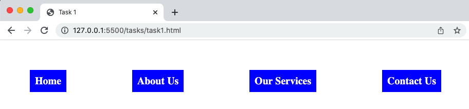
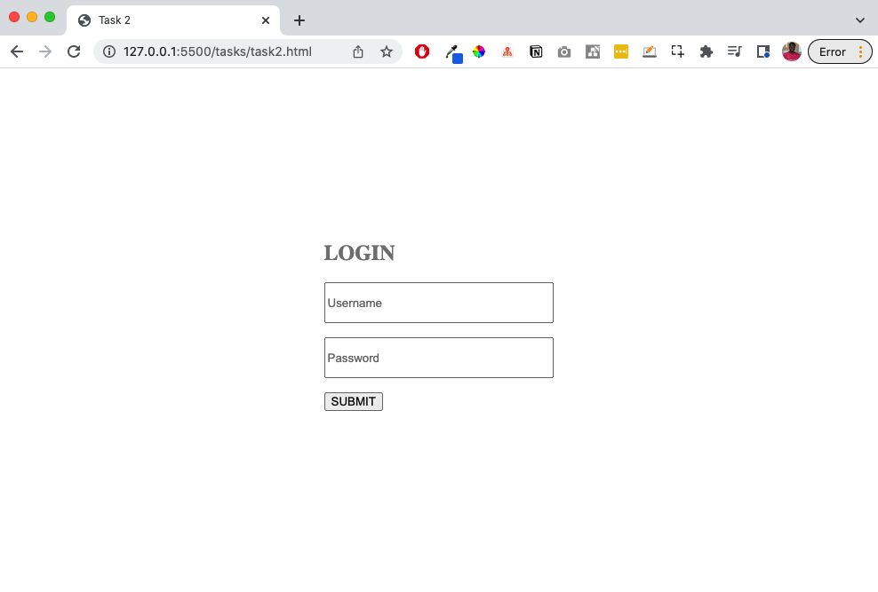
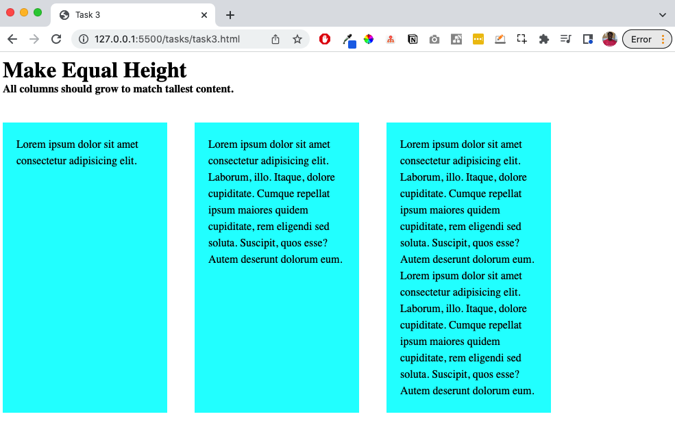
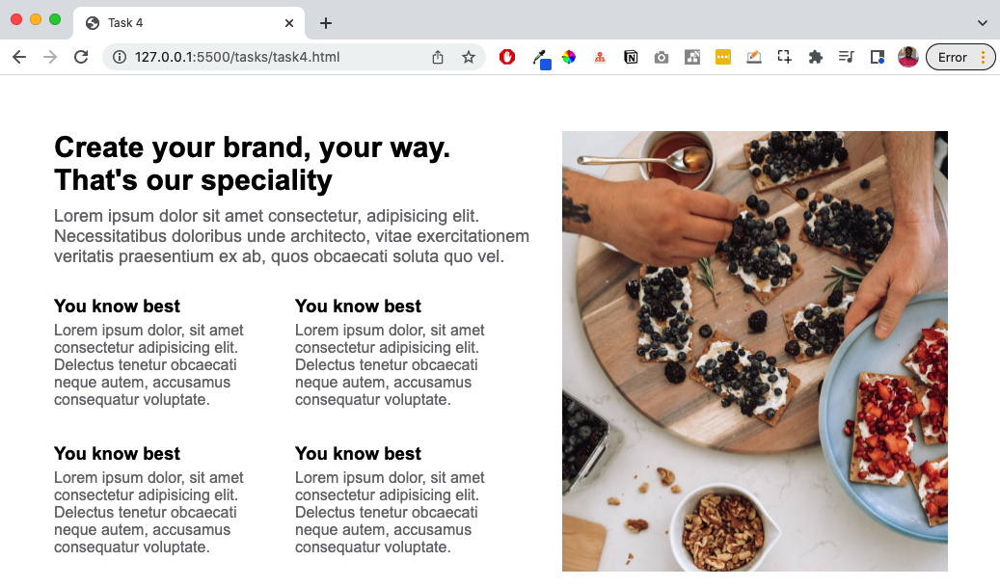

The aim of this skill test is to know how well you understand flexbox and flex items

> **Note:** It is very important to type your code and note copy and paste, this way you are building the muscle memory required to become a great developer.

## Task 1

In this task, create a list of navigation items, objective it to have them horizontal with even amount of space between them.

Your final result should look like the image below:

> **Callout:**
>
> [Download the starting point for this task](https://github.com/kingsley-ijomah/flexbox_assessment/blob/main/tasks/task1.html) to work in your own editor.

## Task 2

In this task, center the login page, so that it is in the center of the page and not stuck top left.

Your final result should look like the image below:

> **Callout:**
>
> [Download the starting point for this task](https://github.com/kingsley-ijomah/flexbox_assessment/blob/main/tasks/task2.html) to work in your own editor.

## Task 3

In this task, use flexbox to make the height of all the coloumns the same regardless of the content size.

Your final result should look like the image below:

> **Callout:**
>
> [Download the starting point for this task](https://github.com/kingsley-ijomah/flexbox_assessment/blob/main/tasks/task3.html) to work in your own editor.

## Task 4

In this task, use your newly found flexbox skill, to style the page to look like the image below

Your final result should look like the image below:

> **Callout:**
>
> [Download the starting point for this task](https://github.com/kingsley-ijomah/flexbox_assessment/blob/main/tasks/task4.html) to work in your own editor.
